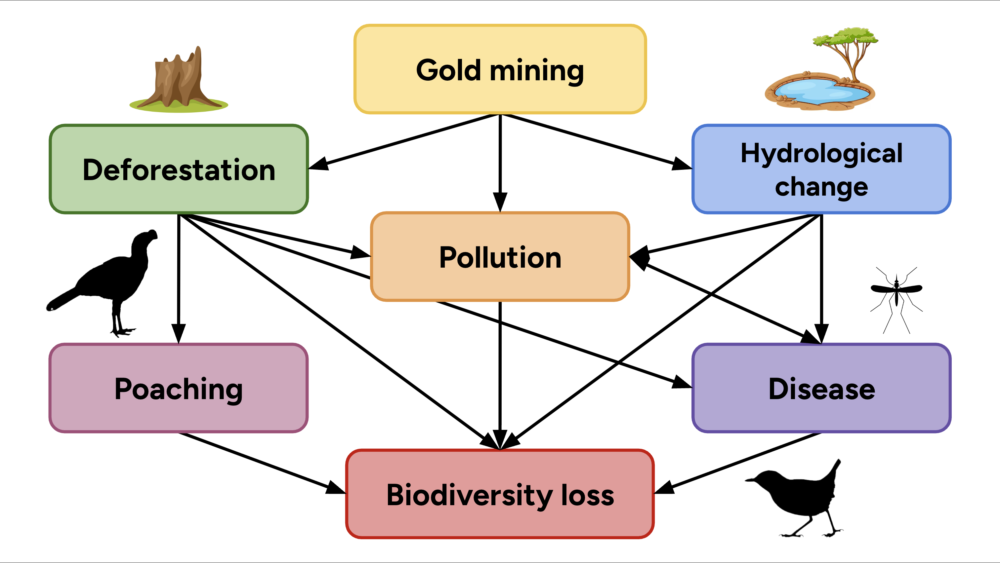
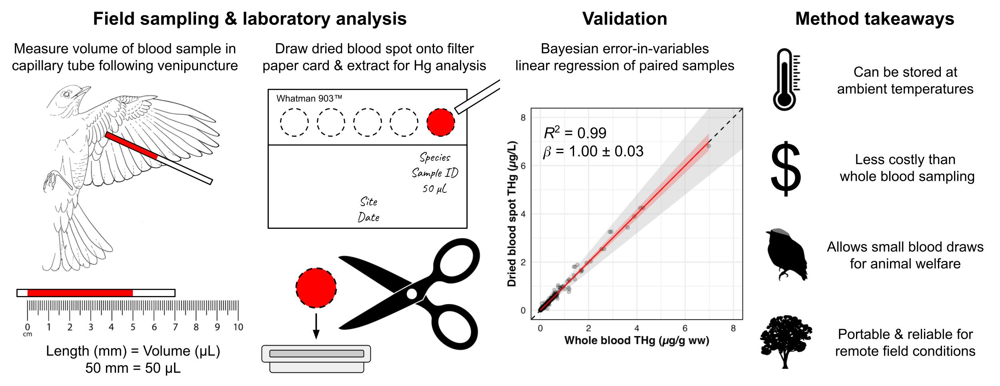
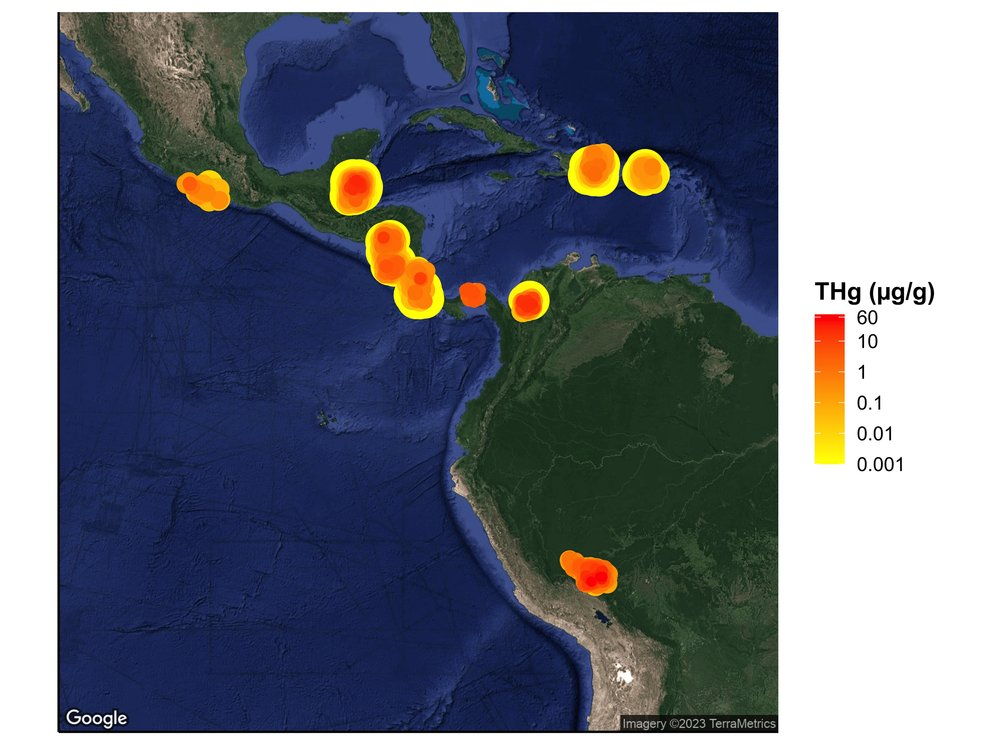
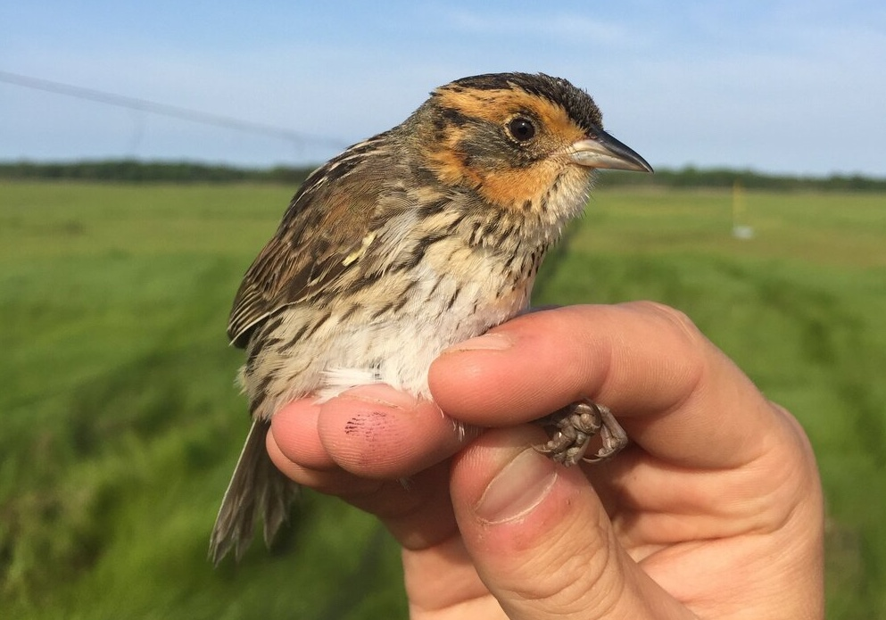

:::::::::::::::::: research-container
::::: research-row
::: {.research-text .order-first}
### Disentangling the impacts of gold mining to biodiversity in the Amazon

A global surge in gold price is causing an ongoing gold rush in the most biodiverse place on Earth: the Amazon. To understand how the environmental disturbances from this industry may contribute to biodiversity loss, we are monitoring how bird communities respond to land cover change, pollution, hunting, and disease while surveying gold mines and conservation reserves in Peru.

Watch the [presentation](https://www.youtube.com/watch?v=cglqB7tkxW0).
:::

::: {.research-image .order-last}
{width="801"}
:::
:::::

------------------------------------------------------------------------

::::: research-row
::: {.research-text .order-first}
### Optimizing heavy metal biomonitoring in the tropics

As mining industries expand to meet the global demand for precious minerals, heavy metal pollution is becoming commonplace throughout the tropics. Blood sampling provides a reliable, nonlethal measurement to track contamination in organisms, but storing samples can be challenging in remote field conditions. We developed a field-ready method to assay heavy metal exposure in birds without needing refrigeration, thereby eliminating logistical barriers and reducing operational costs for contaminant monitoring.

Read the [preprint](https://www.biorxiv.org/content/10.64898/2026.05.27.727713v1).
:::

::: {.research-image .order-last}

:::
:::::

------------------------------------------------------------------------

::::: research-row
::: {.research-text .order-first}
### Summarizing over a decade of Neotropical bird mercury data

Environmental mercury contamination in the Neotropics has been understudied despite rapidly growing emissions from gold mining. To improve our understanding of mercury exposure to terrestrial biodiversity, we established exposure baselines for over 300 bird species across Central America, South America, and the West Indies, and quantified Hg prevalence and variation across taxonomic groups and functional traits.

Read the [article](https://link.springer.com/article/10.1007/s10646-023-02706-y).
:::

::: {.research-image .order-last}
{width="466"}
:::
:::::

------------------------------------------------------------------------

::::: research-row
::: {.research-text .order-first}
### A collaborative network for monitoring pollution in the tropics

Environmental pollution of the global tropics outpaces our understanding of its consequences for biodiversity, and may contribute to regional bird declines. The TRACE Network is an international collaboration that produces, and provides open access to, emerging data on biotic contamination to better inform tropical bird conservation.

To contribute to TRACE, visit our [website](https://briwildlife.org/trace/).
:::

::: {.research-image .order-last}

:::
:::::

------------------------------------------------------------------------

::::: research-row
::: {.research-text .order-first}
### Assessing mercury risk in a group of declining marsh birds

Tidal marsh sparrows are species of conservation concern primarily due to global sea-level rise and habitat loss, but mercury pollution may present additional threats to their reproductive success and survival. We identified clear bioaccumulation differences between species of similar niches, as well as pollution hotspots in previously unsampled areas of their breeding ranges.

Read the [article](https://link.springer.com/article/10.1007/s10646-021-02461-y).
:::

::: {.research-image .order-last}
{width="501"}
:::
:::::
::::::::::::::::::
